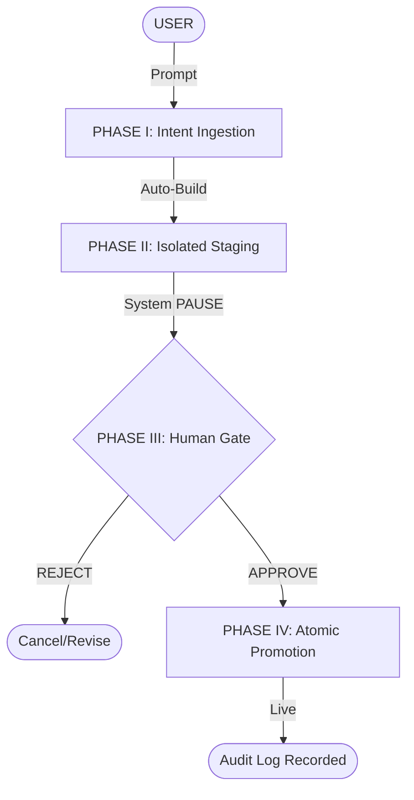

# THE ADRIAN METHOD of AI-Driven CMS Governance

> **⚖️ Legal & Copyright Notice**
> This document is a legally registered Standard Operating Procedure (SOP) and methodology for **AI CMS Governance** under the Directorate General of Intellectual Property (DJKI), Indonesia.
> * **Creator:** Adrian, Alexander
> * **Registration Number:** 001149429
> * **Application ID:** EC002026029885
> 
> *Licensed under [CC BY 4.0](LICENSE). This repository contains the operational framework for managing AI-driven content systems with human oversight.*

---

## Overview
**The Adrian Method of AI-Driven CMS Governance** provides a structured protocol for using AI as a content engine within a CMS environment. It ensures that while AI handles the "heavy lifting" of content generation and staging, the final authority remains human-led through a 4-phase non-bypassable workflow.

## The 4-Phase Protocol
1. **Intent Ingestion:** Normalizing natural language prompts into technical instructions.
2. **Isolated Staging:** Automating deployments to a private "Shadow Environment."
3. **Human Gate:** A mandatory system pause requiring explicit human approval.
4. **Atomic Promotion:** Instantaneous swap to production with automated cache invalidation.

## Operational Flow

## Infrastructure & Cost Efficiency
**The Adrian Method of AI-Driven CMS Governance** is optimized for **Static-First architectures**. By leveraging AI to render content changes into static assets, the framework enables high-performance hosting with near-zero operational overhead.

* **Blob Storage Hosting:** Production content is stored as static files in Blob Storage (e.g., AWS S3, Azure Blob, or Google Cloud Storage). This eliminates the need for expensive, always-on backend servers.
* **Serverless Rendering:** The AI engine and build pipeline only run during the "Phase II" and "Phase IV" execution. You can minimize cost for the seconds it takes to generate and push the static files.
* **Extreme Cost Efficiency:** Since the live site is purely static, infrastructure costs are limited to minimal storage and data transfer fees, drastically reducing the Total Cost of Ownership (TCO).
* **Edge Performance:** By serving content through a Global CDN (Content Delivery Network) linked to the blob storage, the system ensures lightning-fast delivery and inherent resilience against server-side vulnerabilities.

## Business Impact: From Startups to Enterprise
This Method is designed to be highly accessible, bridging the gap between cutting-edge AI performance and operational safety for any business scale:

* **For Small Businesses:** It provides a "Lean & Fast" path to digitalization. By utilizing static hosting and AI-driven updates, small businesses can maintain a high-performance web presence with near-zero infrastructure costs and without needing a dedicated DevOps team.
* **For Large Enterprises:** It provides "Governance at Scale." The framework introduces mandatory guardrails, cryptographic audit trails, and human oversight (Phase III) required to manage complex digital assets while mitigating the risks of automated AI errors.

> "This method is a tool to empower engineers to do more, not a substitute for human ingenuity. It democratizes secure AI management for everyone, from the solopreneur to the global enterprise."

## Real-World Implementation

### Case Study: [Ksatriamitra.com](https://ksatriamitra.com) (Telegram-Driven CMS)
**The Adrian Method** has been successfully implemented to manage the digital presence of a professional industrial service provider. This implementation replaces traditional, complex CMS dashboards with a seamless **Conversational Interface via Telegram**.

#### **The Implementation Model**
* **Interface:** Telegram Bot API (Secure, Mobile-First Management).
* **Infrastructure:** Static Blob Storage with Global CDN.
* **Automation:** GitHub Actions + AI Intent Parsing + Custom Bot Webhook.

#### **Workflow in Practice**
1.  **Phase I (Intent via Telegram):** The business owner sends a natural language instruction to the dedicated Telegram Bot (e.g., *"Update the gallery with the latest coating project for PT Maju Jaya"*).
2.  **Phase II (Automated Staging):** The system triggers a GitHub Actions build, renders the updated static site, and generates a private **Shadow Environment** link.
3.  **Phase III (The Human Gate):** The owner receives a preview link directly in their Telegram chat. They inspect the changes on their mobile device. Once satisfied, they click the **"Approve"** button on the bot interface.
4.  **Phase IV (Atomic Push):** The system atomically promotes the staging build to the live production environment on the Blob Storage and clears the global cache.

#### **Key Outcomes**
* **Zero Admin Overhead:** Content updates are completed via mobile chat without ever needing a laptop or traditional CMS login.
* **Architecture Security:** By utilizing static hosting and Telegram webhooks, the system surface area for attacks is virtually zero.
* **Cost Optimization:** Infrastructure costs are negligible, leveraging pay-per-execution triggers and low-cost static file storage.

---

## ⚠️ Disclaimer: Augmentation, Not Replacement
This Method is built on the philosophy of **AI Augmentation**, not human replacement. 

While this framework allows for rapid, AI-driven content management and significant cost reduction via static architectures, it is **not intended to replace professional software engineers or programmers.** Human expertise remains critical for:
* **High-Level Architecture:** Designing the underlying systems that AI operates within.
* **Complex Logic:** Solving edge cases and business logic that go beyond standard content patterns.
* **Governance & Ethics:** The "Human-in-the-Loop" (Phase III) is a mandatory pillar of this method specifically because human judgment, ethics, and accountability are irreplaceable.

---
